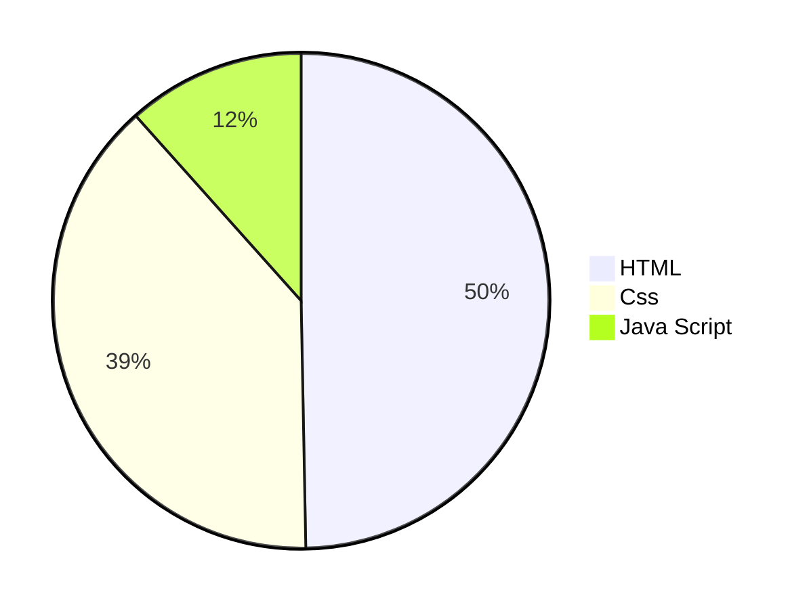

<table align="center"><tr>
  <td>

 
  CODR

 </td>
</tr>
</table>
<h1 align="center">My Portfolio</h1>
<h3 align="center">Details: Build up and Development</h3>

<table align="center">
  <tr>
    <td><strong>Version :</strong></td>
    <td>

 

</td>
  <td> <strong>Deplying Site :</strong> </td>
<td>

 

</td>
  </tr>
</table>
<table align="center">
  <tr>
    <td> <strong>Used Languages :</strong> </td>
    <td>
      

    

    </td>
  </tr>
</table>

<table align="center">
<tr>
<th> 🔗 <strong>Deplyed Websites :</strong> </th>
</tr>
<tr>

<td>

| Magnet Pull | Apple UI |
|--|--|
|||
</td></tr> </table>

 

> [!NOTE]
> This reposiratory is for practicing advanced web building practicing.

> [!CAUTION]
> All (c) copyrights are reserved by Sankha Saha (CODR):  

<h1 aign="center">All details regarding development : </h1>

## Pages :

<table align="center" , width="100%">
<tr>
  <th>Home Page</th>
  <th>Work</th>
  <th>Contact</th>
  <th>About</th>
</tr>
<tr>
 <td width="25%">  </td>
 <td width="25%"> </td>
 <td width="25%"> </td>
 <td width="25%"> </td>
</tr>
</table>

## CSS Files :

<table>
<tr>
<th>Link to Css Files</th>
</tr>
<tr>

<td>

| Component CSS | Locomotive CSS | Normalize CSS | Style New CSS | Styleguide CSS |
|--|--|--|--|--|
|  |  |  |  |  | 
</td></tr> </table>

## Jaca Script Files :

<table align="center">
<tr>
<th>Link to Java Script Files</th>
</tr>
<tr>

<td>

| Index New | Locomotive-Scroll.min |
|--|--|
|||
</td></tr> </table>

# Used Languages in percent :

